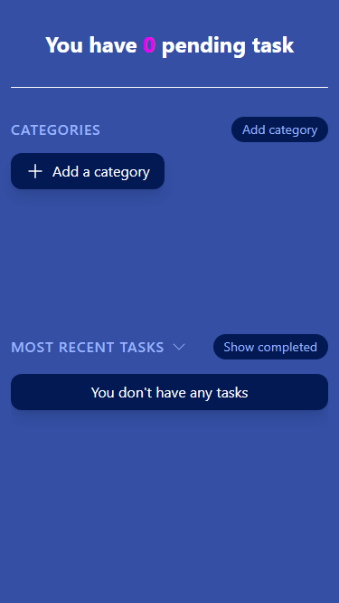
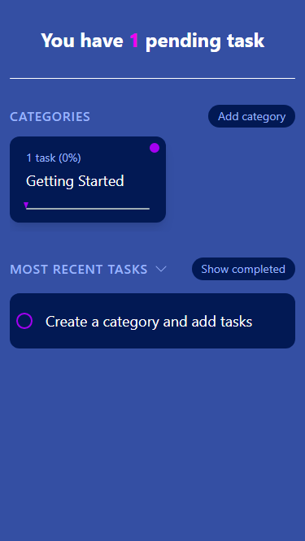
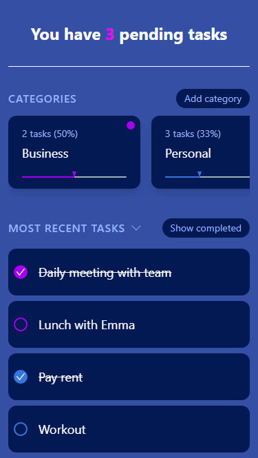
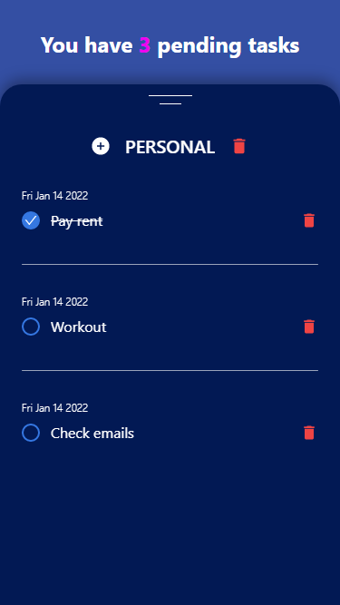

# React Todo App

This is a simple todo app where you can organize your tasks into categories. Tasks can be sorted by most/least recently added and you can show or hide completed tasks.
Data is saved in local storage.

Inspiration for the UI comes from [here](https://dribbble.com/shots/14153121-ToDo-App-Dark-Theme).

## Testing the app

You can install it on your Android device. You can find the APK in `src/apk`.

Or clone the repo and install dependencies. Make sure you already have [`nodejs`](https://nodejs.org/) & [`npm`](https://www.npmjs.com/) installed on your system.

```bash
$ npm install # or yarn
```

Then start the app

```bash
$ npm start # or yarn start
```

**Open your dev tools and click on `toggle device toolbar` or you can press <kbd>Ctrl</kbd> + <kbd>Shift</kbd> + <kbd>M</kbd> to switch to mobile view**.
**This is imperative because the app was only designed for mobile devices**.

## Frameworks / Libraries

The app was built with [`Reactjs`](https://reactjs.org/) and [`Tailwindcss`](https://tailwindcss.com/).
The APK was generated with [`Ionic`](https://ionicframework.com/), [`Capacitor`](https://capacitorjs.com/) and [`Android Studio`](https://developer.android.com/studio).

## The app






